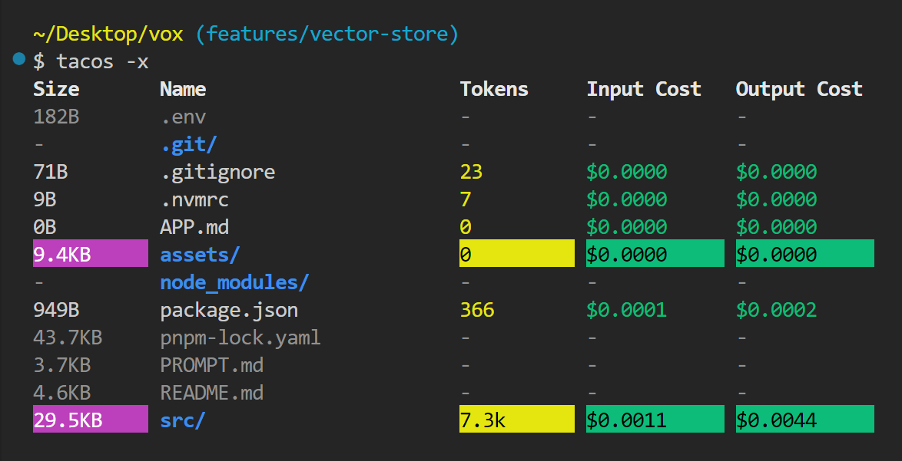

# 🥑 Tacos - Token And Context Output Summarizer



**Tacos** is a CLI tool that recursively analyzes files and directories, estimating token counts and cost metrics for AI model inference. It supports modern **Node.js** (v20.8.0) and ECMAScript 2024, utilizing OpenAI's tokenizer for accurate token estimation.

## 📌 Features

- 📂 **Recursive File Traversal**: Use `-r` or `--recursive` to analyze all files within directories.
- 🔍 **Token & Cost Estimation**: Computes input/output costs based on AI model pricing.
- 🎨 **Colorized Output**: Uses **chalk** to highlight token counts, costs, and cumulative values.
- 🏗 **Model Selection**: Supports various models including GPT-4o, GPT-3.5, and OpenAI’s text embedding models.
- 🚀 **Extensible**: Easily adaptable with additional models or pricing structures.

## 🚀 Installation

Ensure you have **Node.js v20.8.0** installed (as defined in `.nvmrc`).

```sh
npm install -g @brngdsn/tacos
```

## 🛠 Usage

### 🔹 Basic Usage
```sh
tacos
```
This scans the current directory and displays file sizes, token counts, and estimated costs.

### 🔹 Recursive Traversal
```sh
tacos -r
```
or
```sh
tacos --recursive
```
This traverses directories recursively and shows cumulative token/cost summaries.

### 🔹 Recursive Collapse (Summarized)
```sh
tacos -x
```
or
```sh
tacos --recursive-collapse
```
Instead of listing all files, this aggregates directory contents into a single summarized entry.

### 🔹 Custom AI Models
```sh
tacos gpt-4o mini
```
Overrides the default AI model used for cost calculations.

### 🔹 Display Cost Table
```sh
tacos -c
```
Shows model pricing details.

## 📊 Output Example

```
Size       Name                      Tokens     Input Cost   Output Cost   
10.2KB     app.js                     2.1k       $0.0003      $0.0012
14.6KB     index.html                  3.2k       $0.0005      $0.0020
---------
17.8MB     [Cumulative]               450.2k     $0.0675      $0.2701
```

- **Cumulative Rows** swap text/background colors.
- **Ignored files** (from `.gitignore`, `.tacosignore`) are grayed out.
- **Directories** are shown in **blue**.

## 🛠 Development

Clone the repository and install dependencies:

```sh
git clone https://github.com/brngdsn/tacos.git
cd tacos
npm install
```

Run locally:

```sh
node bin/tacos.js
```

Run with custom models:

```sh
node bin/tacos.js gpt-4o mini
```

## 📜 License

MIT License. See `LICENSE` for details.

## 📬 Contact & Issues

- Report bugs: [GitHub Issues](https://github.com/brngdsn/tacos/issues)
- Author: [brn.gdsn@gmail.com](mailto:brn.gdsn@gmail.com)

---
🥑 Made with **Tacos**
